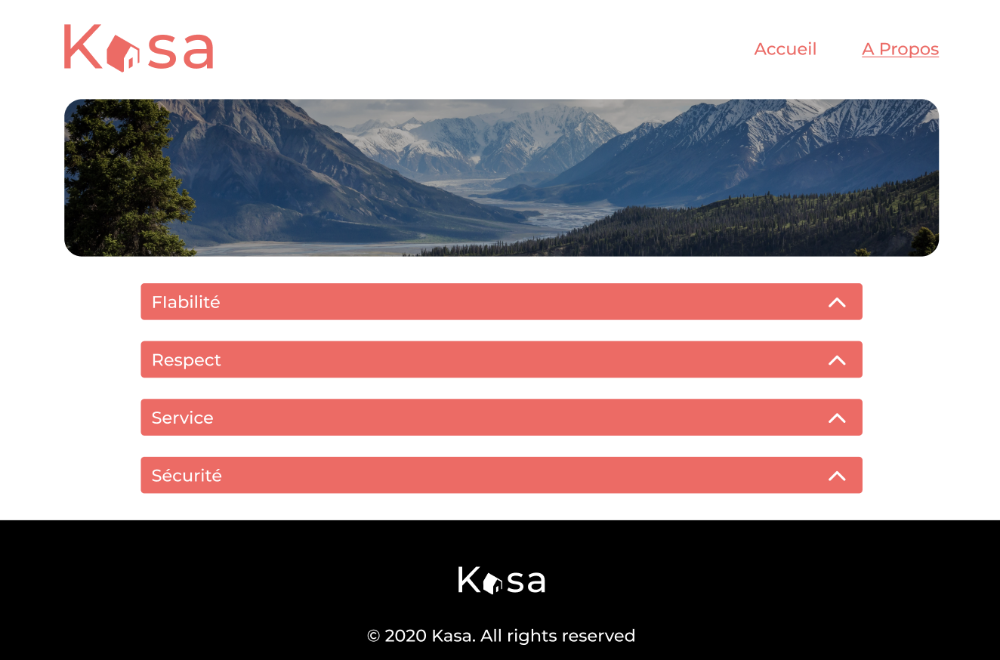

<h1>Kasa Projet 8</h1>

8ème projet du parcours "Intégrateur web" avec Openclassrooms. Création d'une application web de location immobilière avec <b>React</b>. Développement et utilisation de composant, initialisation de React router, développement d'une application complète en React définise ce projet.

<h2>Technos. utilisées</h2>

REACT / SCSS / HTML

<h2>Liens</h2>